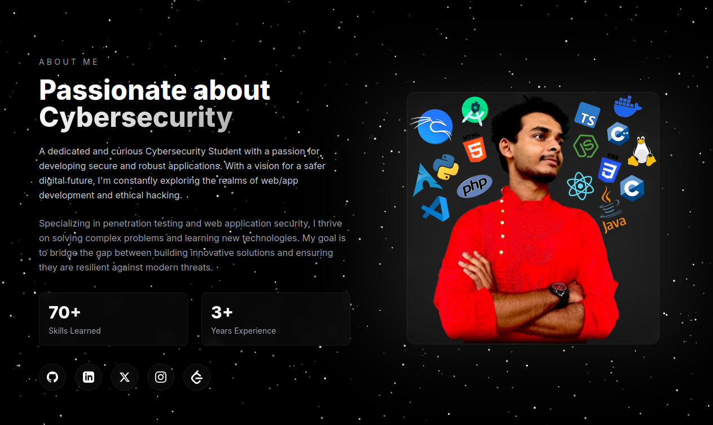

# Rupam Ghosh (Hulo Biral) - Cybersecurity Portfolio Website

<p align="center">
  <a href="./social-preview.png" target="_blank">
    
  </a>
</p>

This repository hosts the source code for the personal portfolio of **Rupam Ghosh** (aka **Hulo Biral**), a dedicated Cybersecurity Student specializing in ethical hacking, penetration testing, and web application security. The website serves as a digital universe to showcase academic background, technical skills, projects, and contact information.

---

## 🚀 Live Demo

Explore the live, deployed version of the website here:

👉 **[https://hulobiral.online](https://hulobiral.online)**

---

## ✨ Features

The portfolio is built with modern web development practices, focusing on performance, accessibility, and a unique, visually engaging design inspired by a "Cybersecurity Universe" theme.

* **Responsive & Dynamic Design:** Optimized for all devices (mobile, tablet, desktop) with a dark, space-themed aesthetic.
* **Custom Cursor:** Enhances desktop user experience with magnetic hover effects.
* **Particle Background:** A subtle, animated canvas background creates an immersive atmosphere.
* **Typing Animation:** Dynamic text in the hero section introduces Rupam Ghosh's multiple roles.
* **Smooth Navigation:** Scroll-spy dots and fixed navigation for seamless movement between sections.
* **SEO Optimized:** Comprehensive Open Graph (OG) and Twitter Card metadata for social sharing, plus JSON-LD structured data.

---

## 🛠️ Tech Stack

This project is a classic and robust static website built entirely with foundational web technologies.

* **HTML5:** Semantic structure for the content.
* **CSS3:** Custom styling and animations (`style.css`).
* **JavaScript (ES6+):** Handling dynamic effects, particle background, typing animation, and magnetic buttons (`script.js`).
* **External Libraries:**
    * **Google Fonts:** Inter and Playfair Display for typography.
    * **Tailwind CSS (via CDN):** Used for rapid, utility-first styling and responsive layout adjustments within `index.html`.

---

## 🏗️ Project Structure
```
├── CONTRIBUTION.md (Guide on how to contribute to this repo)
├── CNAME (Domain configuration for GitHub Pages)
├── LICENSE (MIT License file)
├── index.html (Main application file)
├── pfp.jpeg (Profile Picture)
├── script.js (All JavaScript logic and dynamic effects)
├── social-preview.png (Social sharing preview image)
└── style.css (All custom CSS styling, animations, and dark theme)
```
---

## ⚙️ Local Development

To run and modify this project locally, follow these steps:

1.  **Clone the repository:**
    ```bash
    git clone [https://github.com/hul0/hulobiral-portfolio-html.git](https://github.com/hul0/hulobiral-portfolio-html.git)
    cd hulobiral-portfolio-html
    ```

2.  **Open the file:**
    Since this is a static HTML site with no build tools or server dependencies, simply open the `index.html` file in your preferred web browser.

    ```bash
    # For macOS/Linux
    open index.html
    # For Windows
    start index.html
    ```

3.  **Customize:**
    Edit `index.html`, `style.css`, and `script.js` to customize the content, styling, and interactivity.

---

## 🤝 Contribution

Contributions are welcome! If you find any bugs, have suggestions for new features, or want to improve the codebase, please check out the **[CONTRIBUTION.md](CONTRIBUTION.md)** file for guidelines.

---

## 📝 License

This project is licensed under the **MIT License**. See the **[LICENSE](LICENSE)** file for details.

---

## 📧 Contact

* **Email:** `nmrupam@proton.me`
* **GitHub:** **[@hul0](https://github.com/hul0)**
* **LinkedIn:** **[/in/hulo](https://www.linkedin.com/in/hulo)**

